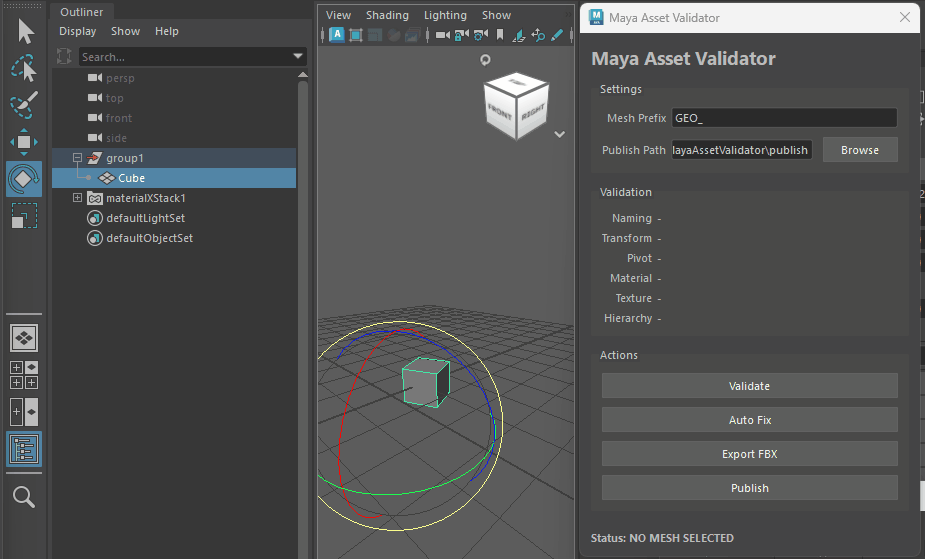
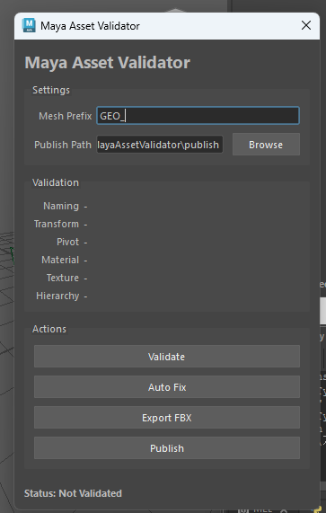
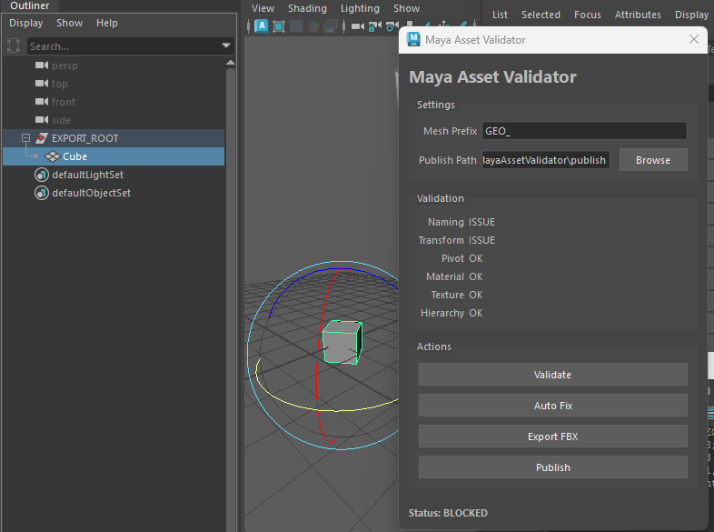
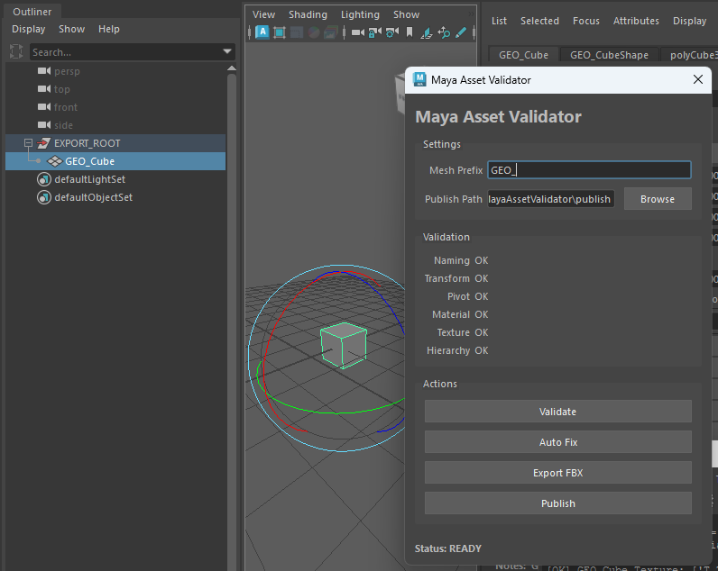

# Maya Asset Validator / Publisher

Maya上の3Dアセットを検証し、  
問題の検出・自動修正・FBX Export・Publishまでをサポートする  
Pythonベースのアセットパイプラインツールです。

アーティストが制作したアセットをゲームエンジンへ渡す前に、  
Naming / Transform / Pivot / Material / Texture / Hierarchyを確認し、  
問題のあるアセットが次工程へ進まないようにします。

---

## Demo



---

## Overview

手作業によるアセットチェックの見落としや  
ヒューマンエラーを減らすことを目的として制作しました。

```text
Artist
  ↓
Validation
  ↓
Auto Fix
  ↓
Re-Validation
  ↓
Export Gate
  ↓
FBX Export / Publish
```

単発のスクリプトではなく、  
アーティストが繰り返し使用するパイプラインツールを想定しています。

---

## User Interface



UIから以下の操作を行えます。

### Validate

選択したMeshを検証し、各項目を `OK / ISSUE` で表示します。

### Auto Fix

安全に自動修正できる以下の項目を修正します。

- Naming
- Transform
- Pivot

修正後は自動的に再Validationを行います。

### Export FBX

Validationを通過したアセットのみFBXとして出力します。

### Publish

設定したPublish Directoryへ、  
アセット名を使用して自動的にFBXを出力します。

---

## Validation

以下の項目を検証します。

| Category | Check |
|---|---|
| Naming | 設定したMesh Prefixを使用しているか |
| Transform | Scale = 1,1,1 / Rotation = 0,0,0 |
| Pivot | Bottom Centerに配置されているか |
| Material | Custom Materialが設定されているか |
| Texture | File Textureが接続されているか |
| Hierarchy | 指定したExport Root配下に配置されているか |

### Issue



問題がある場合は `ISSUE` として表示し、  
Statusを `BLOCKED` にします。

```text
Naming      ISSUE
Transform   ISSUE
Pivot       ISSUE
Material    OK
Texture     OK
Hierarchy   OK

Status: BLOCKED
```

### Ready



すべての条件を満たすと `READY` 状態になります。

```text
Naming      OK
Transform   OK
Pivot       OK
Material    OK
Texture     OK
Hierarchy   OK

Status: READY
```

`BLOCKED` 状態ではExport / Publishを実行できません。

---

## Auto Fix

安全に自動修正できる項目のみを対象としています。

### Naming

設定したMesh Prefixを使用して名前を修正します。

```text
Cube
↓
GEO_Cube
```

Mesh PrefixはUIから変更できます。

```text
GEO_Cube
↓ Prefix: SM_
SM_Cube
```
